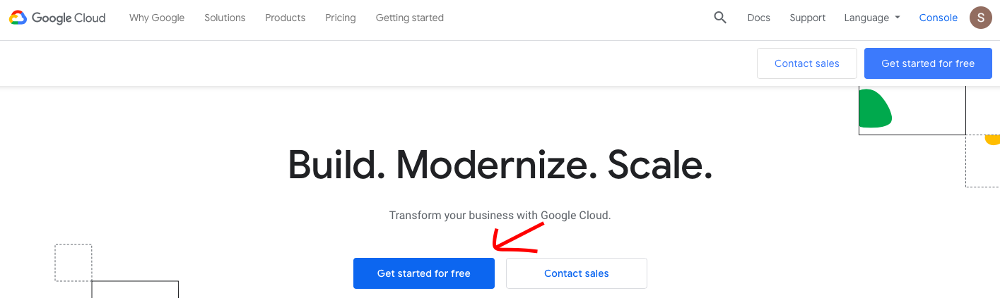
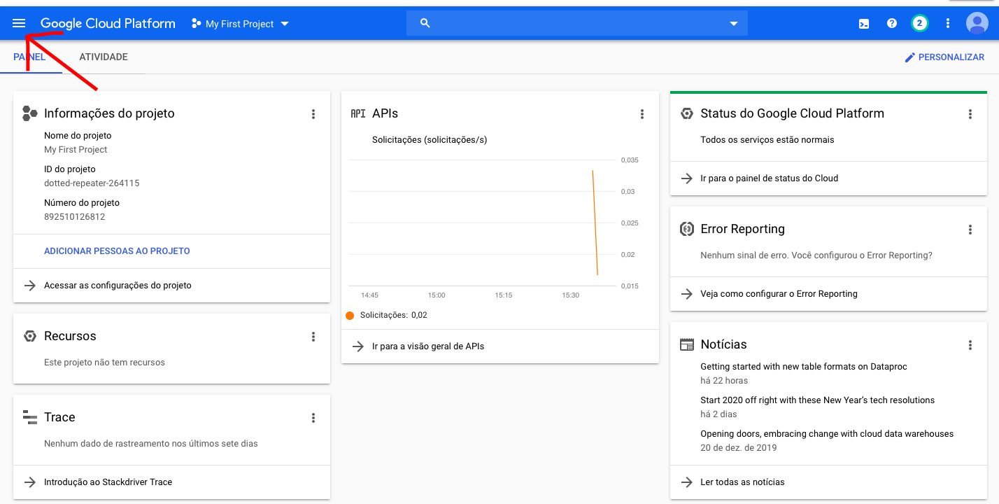
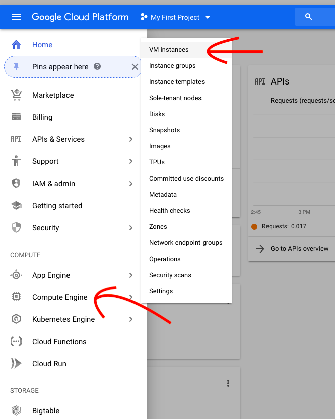
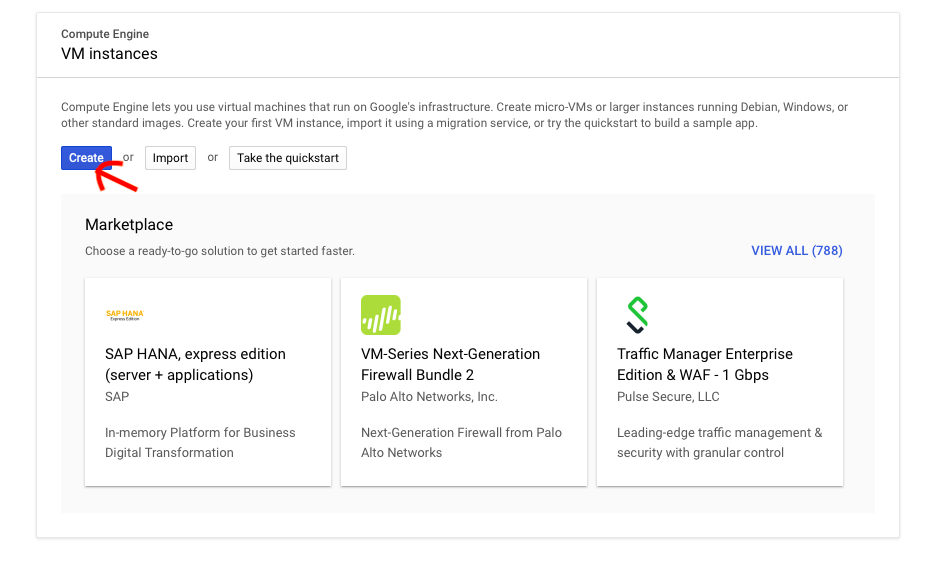
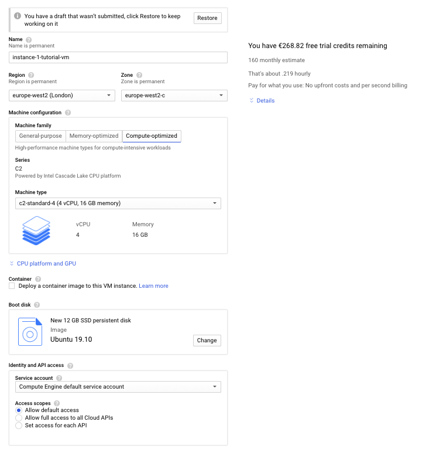
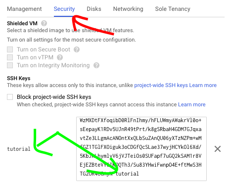
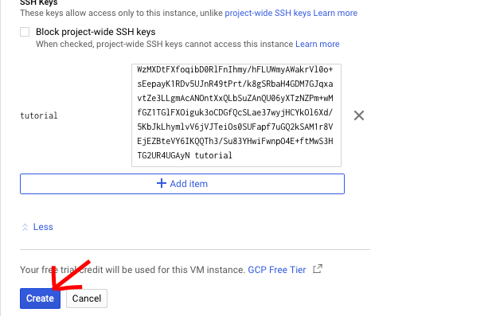
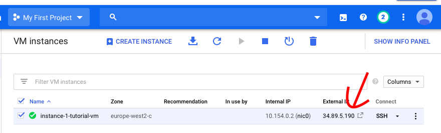

# Google Cloud Setup


## Motivation
When working with a large dataset, our personal computer may not be powerful enough to process it in reasonable time. Therefore this guide details how to move your workflow to the cloud.

### Why Google Cloud?

It's the one we know how to work with. You also get $300 of credit to use on the platform on the first year of using google cloud for a new account.

You can also use, for example, Amazon AWS. The setup there will be slightly different because it is another platform. However, most of the things you will learn in this guide can be applied to other platforms like AWS because in the end these are all platforms for the same service - cloud computing.

## Steps

### 1.1 - Account Registration
Access the [google main website ](https://cloud.google.com). If you already own a google cloud account, skip to step x.x.

Google will request for a credit/debit card. You can easily create a virtual one without money and use it. That will prevent you from getting any unexpected expenses in the future.



### 1.2 - Google Console

After you've finished access the [google console platform](http://console.cloud.google.com/).

Below should be the page you get. Access the top left button to show the navigation menu:



And select "Compute Engine > VM instances"



Google may take a minute or two to load and then you should view the following image:



### 1.3 - Creating a VM

You are lead to a page to specify the configuration of your VM. We will divide this into two parts. The first one is the specs of the VM and the second one is the security to allow you to access the VM from your computer.

You can choose the specs as I have done below:
- Instance name to "instance-1-tutorial-vm"
- Region to London
- Machine type to n1-standard-4
- Boot Disk to Ubuntu 19.0 with 12 GB SSD



Machine type and Boot disk is where you mostly benefit from using a cloud service platform. You can choose really high specs that your personal computer doesn't have and therefore be able to do more memory intensive tasks such as working with data that's too big for your computer to process in a reasonable amount of time.


### 1.4 - Setting up Security

You will now need to setup the basic security measure for your VM which is setting up an **ssh key**. This process is creating a public and a private key. The private key will stay in your computer while you will share the public key with the VM so that it knows that only the computer that shows the corresponding private key when requesting for access, is allowed to access the VM. If it doesn't show a valid private key, the VM will block all access from elsewhere.

You can generate an ssh key from both the terminal (Mac) or command line (Windows). For Mac you can follow the steps provided [here](https://docs.joyent.com/public-cloud/getting-started/ssh-keys/generating-an-ssh-key-manually/manually-generating-your-ssh-key-in-mac-os-x).

During the generation of the key you were asked to specify name for the file, let's call it **\<ssh-keyfile\>**. You should now have two newly created files:
- One for the private key **\<ssh-keyfile\>**
- And another one with the corresponding public key **\<ssh-keyfile\>.pub**

Now you will open the public key file and copy all its contents and paste in the box below:



If you notice, i replaced the last word of the contents with the word "tutorial", let's call this word our **username** for reasons you will see shortly. **Please** do the same for everything to work later.

Now all is left to do is:



You have just completed the setup for your new VM! Hurray!

### 1.5 - Connect to VM

Below should appear your new VM after google processes it for a few seconds.



To connect to the VM go to your terminal/ command line and use the following line of code. Replace what's between \<\> with what you have.

```
ssh -i \<path_to_my_private_key\> tutorial@\<External_Ip\>
```

An example would be:

```
ssh -i /Users/simaonovais/Desktop/mykey tutorial@34.89.5.190
```

If you are on a Mac you might get the following message:

```
Are you sure you want to continue connecting (yes/no)?
```
 and you should reply "yes" and press Enter.

**Warning**: If you are connected to a WIFI from your school or company, then that WIFI might by default block the connection for security reasons.


### 1.5 - Prepare your work environment on the VM.
